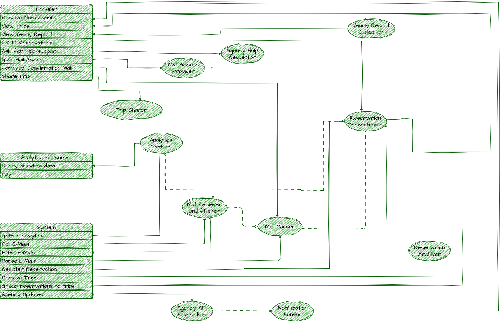
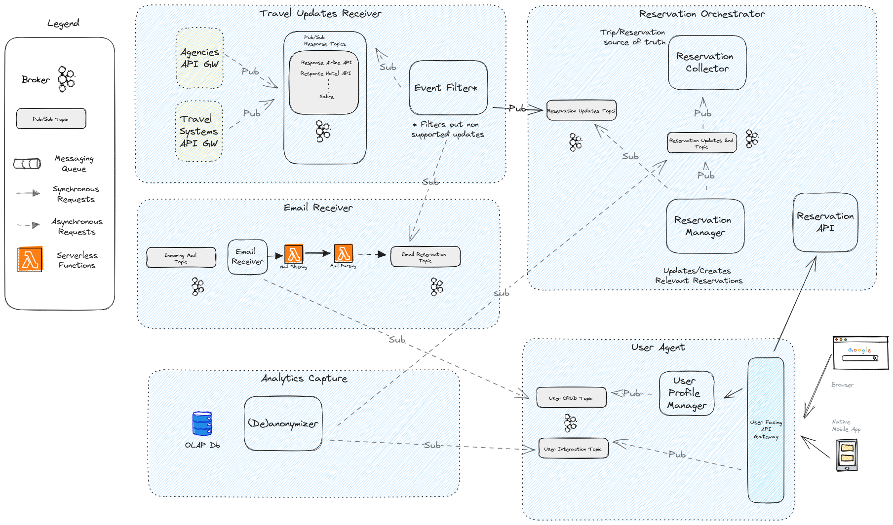
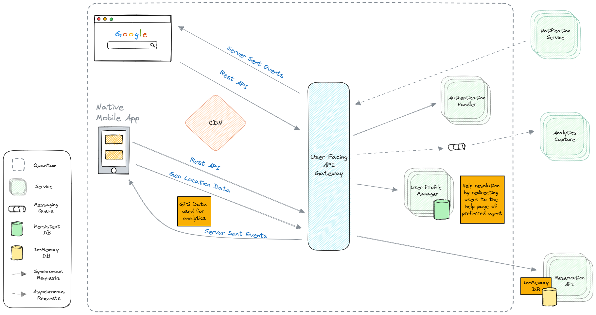
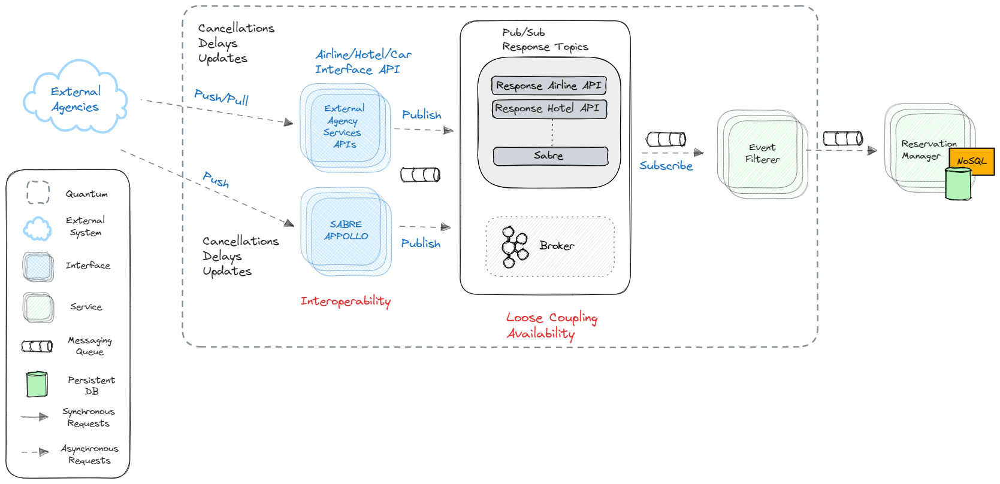
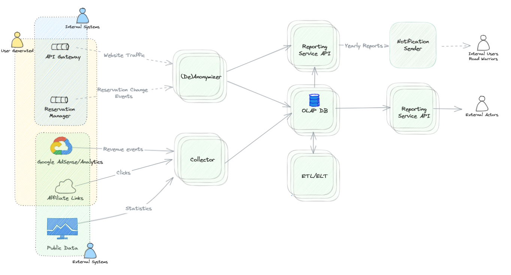

# Architectural Katas - Fall 2023

This repository is our solution to the Fall 2023 [O'Reilly Architectural Katas Challenge](https://learning.oreilly.com/live-events/architectural-katas/0636920097101/0636920097100/).

The goal of the challenge is to enable Road Warrior, a startup aspiring to be a single source of truth for all things related to the trips of its users, to meet its objective.

## Contents
<table border="0">

 <tr style="vertical-align:top">
    <td valign="top" style="vertical-align:top">

**[1. About us](#about-us)**

**[2. Challenge Overview](#challenge-overview)**
* [2.1. Vision](#the-vision)
* [2.2. Scope](#the-scope)

**[3. Domain Design](#domain-design)**
* [3.1. Actors and Use Cases](#use-cases)
* [3.2. Quanta Identification](#quanta-identification)

**[4. Architecture](#architecture)**
* [4.1. System-wide architecture](#system-wide-architecture)
    * [4.1.1. Drivers](#drivers)
    * [4.1.2. System-wide Architecture Characteristics](#system-wide-architecture-characteristics)
    * [4.1.3. Selected architecture](#selected-architecture)
* [4.2. Quanta and Related Architectures](#quanta-and-related-architectures)
    * [4.2.1. User Agent](#user-agent)
    * [4.2.2. Reservations Orchestrator](#reservations-orchestrator)
    * [4.2.3. Travel Updates Receiver](#travel-updates-receiver)
    * [4.2.4. Email Receiver](#email-receiver)
    * [4.2.5. Analytics Capture](#analytics-capture)

</td>
<td valign="top" style="vertical-align:top">

**[5. Deployment](#deployment)**

**[6. ADRs](#adrs)**
* [ADR01 Hybrid Architecture](adrs/hybrid.md)
* [ADR02 API-Gateway](adrs/api-gateway.md)
* [ADR03 CDN](adrs/cdn.md)
* [ADR04 Rest](adrs/rest.md)
* [ADR05 Web and Native Mobile Apps](adrs/web-mobile-application.md)
* [ADR06 Server Sent Events](adrs/server-sent-events.md)
* [ADR07 External-API-Integration](adrs/external-api-integration.md)
* [ADR08 CQRS](adrs/cqrs.md)
* [ADR09 Message Broker](adrs/message-broker.md)
* [ADR10 Specialized DBs](adrs/specialized-dbs.md)
* [ADR11 Analytics OLAP](adrs/analytics.md)
* [ADR12 GDPR](adrs/gdpr.md)
* [ADR13 Deploy Options](adrs/deploy-options.md)
* [ADR14 Availability Deploy Concerns](adrs/availability-deploy-concerns.md)
* [ADR15 Monitoring](adrs/monitoring.md)
* [ADR16 Mail Polling](adrs/mail_polling.md)

    </td>
 </tr>
</table>

## About Us
Our team consists of [Apostolos Mantes](https://www.linkedin.com/in/mantesap), [George Lourakis](https://www.linkedin.com/in/georgios-lourakis-099b79197), [George Panagiotakis](https://www.linkedin.com/in/yiorgos-panayiotakis-71185a5b), [Konstantinos Polydorou](https://www.linkedin.com/in/kpolyd) and [Spyros Economopoulos](https://www.linkedin.com/in/economopoulos). We are members of [Neurocom SA](https://www.neurocom.gr), a greek company focusing mainly on the telecommunication sector, located in Greece.

[Back to Contents](#contents)

## Challenge Overview

### The Vision

Be the single source of truth for all things trip related.

### The Scope

At this stage focus on 
* flights
* hotels 
* car rentals

Keep in mind the vision and consider how the platform will embrace trains, buses, attractions etc. etc.

[Back to Contents](#contents)

# Domain Design

## Actors and Use Cases

The identified actors and use cases appear in the following diagram

Which led to the identification of the initial building blocks of the system

[Back to Contents](#contents)

## Quanta Identification

We considered in our early discussions that there are parts in the system that should exhibit different characteristics (please see also [below](#architecture)).

Based on this observation and the initial building blocks, we utilized the quantum concept (https://learning.oreilly.com/library/view/fundamentals-of-software/9781492043447/ch07.html#sec-quantum-def) during our analysis to identify the different parts of the platform that serve different needs and demonstrate those characteristics.

This is the final list along with each quantum responsibilities 

* User Agent
  * Interact with the user (display dashboard, receive commands etc.)
  * Capture analytics metrics
  * Store and publish user profiles
  * Push notifications
  * Share content to social media via related APIs
* Travel Updates Receiver
  * Connect with travel agent and travel systems
  * Receive notifications and filter the ones associated with active reservations
  * Translate notifications to the system internal format and push them to the reservation orchestrator
* Email Receiver
  * Connect to our email server and poll for forwarded reservations
  * Connect to user mailboxes and filter out travel related emails (reservation + updates)
  * Translate message information to the system internal fomat and push them to reservation orchestrator
* Reservation Orchestrator
  * Receive user requests from the user agent and return relevant information
  * Receive user commands from the user quantum and update trips/reservations accordingly
  * Receive messages from travel notifications and email receivers and update trip accordingly
* Analytics Capture
  * Collect analytics data from user agent, email receiver and travel update receiver quanta and store them for analysis
  * Anonymize data for use with analytics consumers 
  * Prepare yearly reports and push them to end users through the user agent

[Back to Contents](#contents)

# Architecture

## System-Wide Architecture

### Drivers

#### Key Metrics
* 2 Million Weekly Active Users
* 15 Million Total Users
* 800 ms web response time
* 1.4 sec mobile app contentful paint
* 5 minutes end to end update limit
* 99.99% ("four nines") availability

#### Assumptions
We assume that most, e.g. 80%, of the users will mostly interact with the app within a four - hour time frame in working days corresponding to 1.6M users accessing the site in 5 * 4 * 3600 = 72K sec, leading to an expected number of 25 requests / second. 

We do not expect a sudden burst of requests, maybe an increase in holiday periods but certainly not something we will make us have to respond immediately.

Assuming an average of 5 reservations per active user (to accommodate attractions or events) and an average trip duration of two weeks we expect 2 million * 5 = 10 million reservations per two weeks = 5 million per week (~250 million reservations per year).

We expect on average 5 updates per reservation => 25 million relevant update events per week (of course the updates we will have to process will be much higher. Suppose we have captured 5% of the market we expect 20 times this number in total, leading to 500 million update events per week), i.e. ~1000 reqs per second.

Email parsing, if we consider the 'share your mailbox approach' is much more challenging. Suppose 30% of our users have opted in for this option and that the average user receives 100 emails per day, we need to filter 30% * 5M * 100 = 150M emails per day, i.e. ~4000 reqs per second. 

#### Additional Drivers

* The system must interoperate with as many as travel agent API's as possible
* We plan to expand to international markets

[Back to Contents](#contents)

### System-Wide Architecture Characteristics

Given the above we have identified the following top three architecture characteristics:

* Availability: Since the application must be available to ensure the best customer experience
* Interoperability: Since we need to interoperate with a lot of travel agents at both national and international level
* Scalability: Since we both plan to expand and anticipate periods with higher traffic 
* Configurability: Since this will be an international application with different time zones, currencies, confirmation email languages etc. etc.

Additional applicable characteristics that we considered were:

* Performance especially with regard to external information sources: We decided to address it in the quantum level
* Deployability: To allow us to quickly onboard new travel agents and reservation types. This will be aided by allowing each quantum to be deployed separately (and possibly in parallel).
* Fault Tolerance: To allow the system to operate in case of e.g. network issues with external agents / travel systems and/or email providers. We consider that we can address this issue with the CRUD operation provided to the end user as well as the option to parse email updates on top of confirmation emails.
* Data Consistency: To avoid false notifications to alarm the user or miss important information. Again, we decided to address this issue in the corresponding quanta.
* Security, we did not identify a specific security requirement (apart from GDPR which we addressed in the analytics quantum) and email sharing which we expect to be standardized.

### Selected Architecture

Based on the characteristics identified, and using the provided template, we came up with the following top matching architectures:

We decided to select a [hybrid microservices event-driven architecture](adrs/hybrid.md) because it both scores well in most of our characteristics and fits well with asynchronous processing which we think is central to our application. 

[Back to Contents](#contents)

### System-wide Architectural Diagram

The system-wide architecture is depicted in the following diagram. 

## Quanta and Related Architectures

We then focused on each quantum and discussed the characteristics that it should demonstrate. Here is what we came up with:

### User Agent

The following diagram describes the architecture for the user agent quantum

We identified the top architectural characteristics of this quantum to be the following:

- Deployability: Because we need to be able to perform A/B testing with different versions of the application as features are being added
- Availability: Because the application must be available 99.99% ("four nines") of the time
- Performance: To allow for 0.8s and 1.4s response time in Web and Mobile 
- Configurability: To allow internationalization, different currencies etc.

More details for the user agent quantum can be found here:
[User Agent Quantum Details](quanta/user_agent.md)

[Back to Contents](#contents)

#### Reservations Orchestrator
The following diagram describes the reservations orchestrator quantum

We identified the top architectural characteristics of this quantum to be the following:

- Data Consistency: To provide accurate and up-to-date information to the user.
- Availability: Because it is the central component in the 'critical path' of the user's experience.

More details for the reservations orchestrator component can be found here:

[Reservations Orchestrator Quantum Details](quanta/reservation_orchestrator_quantum.md)

#### Travel Updates Receiver
The following diagram describes the architecture for the travel updates receiver quantum

We identified the top architectural characteristics of this quantum to be the following:

- Interoperability: Because we need to be able to interface with as many sources of relevant information as possible.
- **Data Consistency ????? : Because we expect API notifications (especially from Sabre/Apollo) to arrive much faster than emails and be 100% accurate.**
- Scalability: Because we will add additional data sources as time goes by.

More details for the travel updates receiver quantum can be found here:
[Update Receiver Quantum Details](quanta/travel_updates_receiver_quantum.md)

[Back to Contents](#contents)

#### Email receiver
The following diagram describes the architecture for the email receiver quantum.

We identified the top architectural characteristics of this quantum to be the following:

- Performance:  Because we have to process a lot more emails to identify the ones that are really relevant. Also we will need to process emails of all users, including inactive ones, at all times.
- Scalability:  Since we expect to go international - and we consider growth is a key metric for any startup - email volume will be a multiple of user growth. 
- Availability: Because: 
  - the majority of reservations will arrive via email 
  - some travel agents might not provide APIs 
  - possible downtime in API communication will render email our last resort for updates.
More details for the email receiver quantum can be found here:

[Email Receiver Quantum Details](quanta/email_receiver_quantum.md)

[Back to Contents](#contents)

#### Analytics Capture
The following diagram describes the architecture for the Analytics Capture in detail.

We identified the top architectural characteristics of this quantum to be the following:

- Deployability: To accomodate processing of new information and constantly adding new reports
- Configurability: To allow internationalization, different currencies etc.

[Analytics Capture Quantum Details](quanta/analytics_capture_quantum.md)

[Back to Contents](#contents)

## Deployment

Deploying our system using containerized applications or serverless functions  offers a flexible and efficient
approach to streamline application deployment process ([ADR13 Deploy Options](adrs/deploy-options.md)).

Kubernetes has become increasingly popular due to the numerous benefits it offers
for managing containerized workloads in a scalable, resilient, and automated manner.
It becomes an even more attractive choice for our system since we can setup and utilize a service mesh (e.g. Istio)
which complements container orchestration handling of Kubernetes by addressing service-to-service communication,
security, and observability challenges ([ADR15 Monitoring](adrs/monitoring.md))

Finally, it makes sense to utilize a managed Kubernetes service to run Kubernetes in the cloud and on-premises data centers
in hybrid fashion to reduce costs, but also to achieve geographical distribution and enhanced availability ([ADR14 Availability Deploy Concerns](adrs/availability-deploy-concerns.md))
