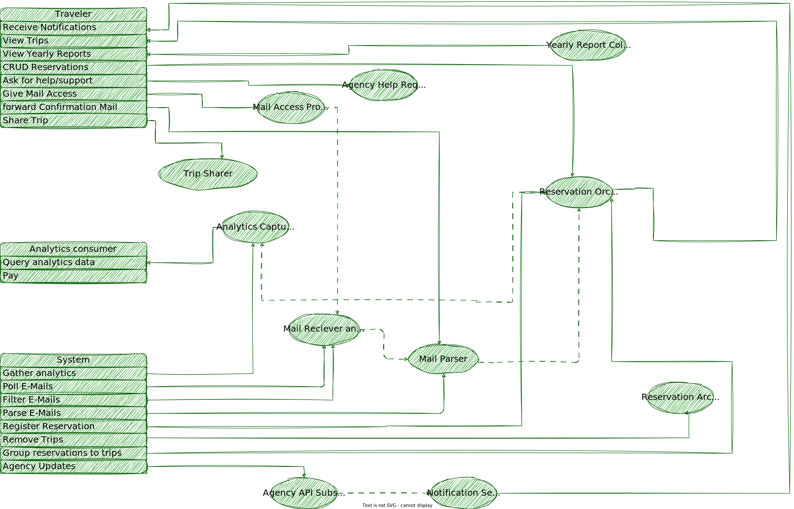
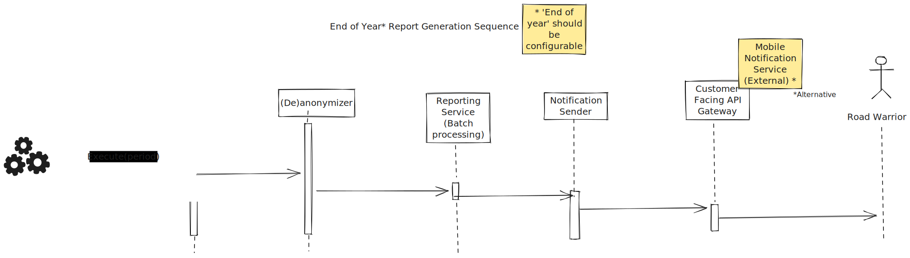

# Architectural Katas - Fall 2023

This repository is our solution to the Fall 2023 [O'Reilly Architectural Katas Challenge](https://learning.oreilly.com/live-events/architectural-katas/0636920097101/0636920097100/).

The goal of the challenge is to enable Road Warrior, a startup aspiring to be a single source of truth for all things related to the trips of its users, to meet its objective.

## Contents
<table border="0">

 <tr style="vertical-align:top">
    <td>

**[1. About us](#about-us)**

**[2. Challenge Overview](#challenge-overview)**
* [2.1. Vision](#the-vision)
* [2.2. Scope](#the-scope)

**[3. Domain Design](#domain-design)**
* [3.1. Actors and Use Cases](#use-cases)
* [3.2. Quantum Identification](#quantum-identification)

**[4. System Architecture](#system-architecture)**
* [4.1. System-wide architecture](#system-wide-architecture)
    * [4.1.1. Drivers](#drivers)
    * [4.1.2. Architecture Characteristics](#architecture-characteristics)
    * [4.1.3. Selected architecture](#selected-architecture)
* [4.2. Quantum Architectures](#quantum-architectures)
    * [4.2.1. User Interaction Quantum](quantums/user_interaction_quantum.md)
    * [4.2.2 Travel Notifications Receiver](quantums/travel_notifications_receiver_quantum.md)
    * [4.2.4 Email Receiver](quantums/email_receiver_quantum.md)
    * [4.2.5 Reservation Orchestrator](quantums/reservation-orchestrator-quantum.md)
    * [4.2.6 Analytics Capture](quantums/analytics_capture_quantum.md)
* **** Analytics Collector Maybe *****?
    * [4.2.7 Activity Summarizer](#activity-summarizer)

**[6. Sequence Diagrams](#sequence-diagrams)**
* [6.1. Road warrior initiated CRUD](#road-warrior-initiated-crud)
* [6.2 Notification Reception]()
* [6.3 Yearly Report Generation](#yearly-report-generation)
    </td>
 </tr>
</table>

## About Us
Our team consists of [Apostolos Mantes](https://www.linkedin.com/in/mantesap), [George Lourakis](https://www.linkedin.com/in/georgios-lourakis-099b79197), [George Panagiotakis](https://www.linkedin.com/in/yiorgos-panayiotakis-71185a5b), [Konstantinos Polydorou](https://www.linkedin.com/in/kpolyd) and [Spyros Economopoulos](https://www.linkedin.com/in/economopoulos). We are members of [Neurocom SA](https://www.neurocom.gr), a greek company focusing mainly on the telecommunication sector, located in Greece.

[Back to Contents](#contents)

## Challenge Overview

### The Vision

Be the single source of truth for all things trip related.

### The Scope

At this stage focus on 
* flights
* hotels 
* car rentals

Keep in mind the vision and consider how the platform will embrace trains, buses, attractions etc. etc.

[Back to Contents](#contents)

# Domain Design

## Actors and Use Cases

The identified actors and use cases appear in the following diagram

Which led to the identification of the initial building blocks of the system

[Back to Contents](#contents)

## Quantum Identification

Based on the initial building blocks, we then utilized the quantum concept (https://learning.oreilly.com/library/view/fundamentals-of-software/9781492043447/ch07.html#sec-quantum-def) during our analysis to identify the different parts of the platform that serve different needs and demonstrate possibly different characteristics.

This the final list along with each quantum responsibilities 

* User Interaction Quantum
  * Interact with the user (display dashboard, receive commands etc.)
  * Capture analytics metrics
  * Push notifications
* Travel Updates Receiver
  * Connect with travel agent and travel systems
  * Receive notifications and filter the ones associated with active reservations
  * Translate notifications to the system internal format and push them to the reservation orchestrator
* Email Receiver
  * Connect to our email server and poll for forwarded reservations
  * Connect to user mailboxes and filter out travel related emails (reservation + updates)
  * Translate message information to the system internal fomat and push them to reservation orchestrator
* Reservation Orchestrator
  * Receive user requests from the user interaction quantum and return relevant information
  * Receive user commands from the user interaction quantum and update trip accordingly
  * Receive messages from travel notifications and email receivers and update trip accordingly
* Analytics Capture
  * Collect analytics data from user interaction, email receiver and travel update receiver quantums and store them for analysis
  * Anonymize data for use with analytics consumers ???and provide them through a dedicated API??? HOW?
  * Prepare yearly reports and push them to end users through the user interaction quantum
* (SHOULD WE SEPARATE ANALYTICS COLLECTION FROM YEARLY REPORTS? THEY DO SEPARATE JOBS - ALSO DO WE NEED A SE) => Activity Summarizer

[Back to Contents](#contents)

# System Architecture

## Overall Architecture

### Drivers

[Back to Contents](#contents)

### Overall Architecture Characteristics

[Back to Contents](#contents)

### Selected Architecture

Apart from quantum characteristics, the system must also demonstrate characteristics as a whole. We selected the following:

Top:
Reliability: Because we do not want customers rushing to the airport due to a false alarm
Scalability: To support future growth
*Performance*????: To honour the required SLAs despite large number of moving parts with different characteristics

Others considered:
Security, which we considered as implicit in the solution

Since we have several quantums with different performance characteristics, and considering the system as a whole, we decided to choose a distributed, event-driven architecture.

TODO: Link to  system wide ADR

[Back to Contents](#contents)

## Quantum Architectures

Note: Critical path 5 min - Availability + End to end performance
We then focused on each quantum and discussed the characteristics that it should demonstrate. Here is what we came up with:

[Back to Contents](#contents)

### User Interaction Quantum
Deployability: Because we need to be able to perform A/B testing with different versions of
Availability: Because the application must be available
Performance:

Architectural Style: Service Oriented

[Back to Contents](#contents)

#### Travel Notifications Receiver
Interoperability: Because we need to be able to interface with as many sources of relevant information as possible.
Availability: Because we expect API notifications (especially from Sabre/Apollo) to arrive much faster than emails and be 100% accurate.
Scalability: Because we will add additional data sources as time goes by.

Others considered:

Architectural Style: Microservices (Pipeline ???)

[Back to Contents](#contents)

#### Email receiver
Top:
 Reliability:  Because we consider very important that the platform identifies reservations rather than the user creates them through the user interface.
 Availability: Because of possible API non-existence for some travel agents and possible interruptions in Sabre/Appolo. Email will be our last resort.
 Performance:  Because we have to process a lot more emails to identify the ones that are really relevant. Also we will need to process emails of all users, including inactive ones, at all times.
 Scalability:  Since we expect to go international - and we consider growth is a key metric for any startup - and email volume will be a multiple of user growth. 

Others considered:
 Fault tolerance: Not deemed important because 

Architectural Style: Event Driven (Pipeline?)

[Back to Contents](#contents)

#### Reservations Orchestrator
 Data Consistency: To provide accurate and up to date information to the user.
 Availability: Because it is the central component in the 'critical path' of the user's experience.

Architectural Style: Service Oriented?

#### Analytics Collector
 Fault
 Configurability: To allow internationalization, different currencies etc. etc.

Architectural Style: Service Oriented

#### Activity Summarizer

# Sequence Diagrams

The following sequence diagrams demonstrate how core operations are carried out end-to-end, as a means of better understanding of the architecture.

## Road Warrior Initiated CRUD

The corresponding diagram for the alternative architecture considered is below

[Back to Contents](#contents)

## Travel Update Reception

[Back to Contents](#contents)

## Yearly Report Generation

[Back to Contents](#contents)
