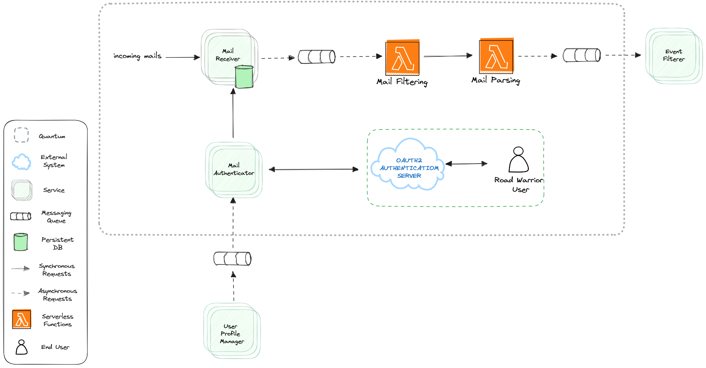

# Email Receiver Quantum

The following diagram describes the architecture for the Email Receiver in detail.

## Components

### Mail Receiver
- Responsible for fetching incoming emails from the mail servers.
- Uses industry standard protocols like IMAP or POP3 to retrieve emails securely.
- Since we anticipate a high volume of emails, we integrate a message queue system (e.g., RabbitMQ, Apache Kafka) between the Mail Receiver and Mail Filtering component.
- We have chosen to implement the Mail Receiver as a microservice because it involves continuous monitoring of email servers, which may require long-running processes and better control over resource management.
- A database will be used to store authentication-related data and email information.

### Mail Filtering
- Monitors the mail queue for new email messages fetched by the Mail Receiver.
- Implements a filtering mechanism that checks incoming emails against a whitelist with the email addresses of the most popular travel agencies (airlines, hotels, car rentals) provided by the system and a user's configured list of email addresses. 
- Utilizes NLP libraries (e.g., Apache OpenNLP, StanfordNLP) to extract relevant information from the email content and filter out non travel related emails. 
- The Mail Filtering component will be implemented as a serverless Lambda function. Serverless is suitable for this component because it responds to individual email events, requires auto-scaling, and can leverage event-driven triggers.

#### Other Considerations
- We also considered an implementation using webhooks for a more efficient and responsive approach to email event handling.
- We also considered a functionality where the user will use a Road Warrior domain email for all the travel related communications. In this scenario all the incoming emails will be routed to the Mail Parsing and forwarded to the personal emails of the user.
- Both alternatives, despite improving the privacy of the users and the performance, were not selected because they would add complexity to the user. 

### Mail Parsing
- Analyzes the content of the filtered emails to identify reservation-related information.
- Utilizes regular expressions, Natural Language Processing (NLP) techniques, or custom parsing rules to extract relevant data. 
- Converts extracted data into a structured format (e.g., JSON or XML) that can be easily processed and queued for further processing. 
- UNIVERSAL??????????????????????????????
- The Mail Parsing component will also be implemented as a serverless Lambda function. Serverless is appropriate because it provides on-demand processing for parsing individual emails and allows auto-scaling based on the volume of incoming emails.

### Mail Authenticator
- Manages the authentication process with the mail server on behalf of the user. After the user’s confirmation the Mail Authentication component receives a token (e.g., OAuth2 access tokens) and stores it in the Mail Filtering Database. 
- A mechanism to refresh the access token using the refresh token when it expires is implemented. 
- The Mail Authenticator will be implemented as a microservice because it manages user authentication and authorization, which may involve more complex business logic and user management tasks.

## Communications Between Components
Communication between components will be facilitated through well-defined APIs (e.g. REST ) and messaging queues. 

## Architectural Style Preferred
Hybrid: Microservices - Event Driven Architecture

## Related ADRs
- [Hybrid Architecture](../adrs/hybrid.md)

