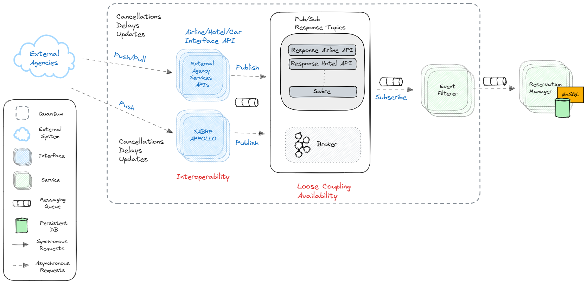

# Travel Updates Receiver Quantum

The following diagram describes the architecture for the Reservation Updates Receiver sub-system.

## Components

### External Agency Interfaces

Independent component that implement multiple interfaces to interact with external APIS.
An abstraction layer to tackle integration scenarios where external systems use different protocols or data formats.
Essentially these components act as event sources for updates (e.g. cancellations,delays,updates) originated from external systems.

We can assume that Sabre and Apollo interfaces support push protocols for notifying external systems about updates.
We also consider that other external agency interfaces may support push or pull protocols for notifications.

### Event Filterer

Stateless component that handles filtering of events
- discards duplicate events (may receive same update from multiple external sources) using small in-memory cache
- filter events that are out of scope for our domain

## Related ADRs
- [ADR07 External-API-Integration](../adrs/external-api-integration.md)
- [ADR09 Message Broker](../adrs/message-broker.md)
