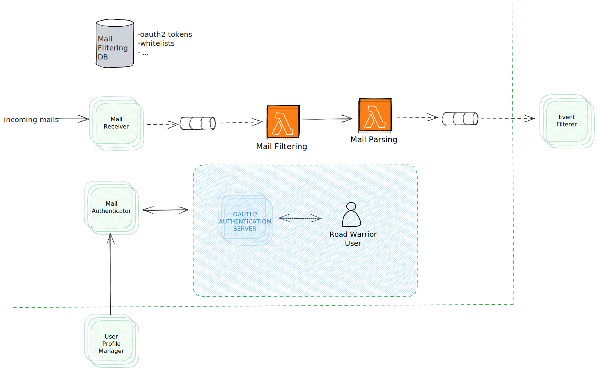

# Email Receiver Quantum
The connection capability enables civilians and officers to connect through the **Hey, Blue!** ecosystem. The following capabilities are provided by this capability.
- Civilians can look up officers who agreed/configured on their site to be found by search. In that case an officer opted in for look-up.
- Civilians and officers might connect via QR code or the previously described online look-up. The processes are clearly defined and supported by a notification infrastructure based on messaging.
- Civilians are being rewarded **Hey, Blue!** points when successfully connecting with officers.
- Officers are being rewarded **Hey, Blue!** points when successfully connecting with civilians.
- When connecting via QR code, a proximity matching service verifies proximity of the participants by assessing a history of geospatial data.
- Civilians might share their connection with social media platforms.

The following diagram describes the architecture for the Email Receiver in detail.

## Components

### Mail Receiver
- Stores officer information when officers opted in for look-up by setting the respective preferences in their profile.
- Civilians can find those officers by look-up in their mobile application. A restriction on location / zip code might be put in place. Further policies might be enforced.

### Mail Filtering
- Database holding location streaming data, e.g. `{"user": "userId", {"long": "...", "lat": "..."}, "timeStamp": ...}` entries, for all users and officers with active location tracking.
- The service is being used by the connection service to make sure officers and users are nearby when a connection is being established.
- Since we use a messaging system, such as Kafka, anyway, spatial data can be streamed and stored within Kafka. This is espetially handy since we have no intention of storing this spatial data long-term in which case Kafka might not be the best choice.

### Mail Parsing
- This service stores the actual connections. 
- It is being triggered by user interaction through the BFF, checks up on user data, reconciles with the proximity matching and triggers the appropriate notifications for the connection establishment workflow.

### Mail Authenticator
- This is simply an abstraction layer to publish connections on various social media platforms.
- Various social media platforms might be added as plugins over time.

### Mail Filtering Database
- This service is described in more detail in the [User capability](../domain/user-capability.md).
- Points created during a connection establishment need to be awarded to the user (both civilians and officers).

## Communications Between Components
Notifications and the awarding of points can be asynchronous to decouple the system and handle load spikes gracefully (see [ADR02 Event-Driven Design](../ADRs/2022-10-31_02-event-driven-design.md)). Some operations like the lookup of an officer or the connection service querying the proximity matcher should be synchronous to receive an instantaneous result which blocks the current flow of interactions.

## Communications Between Components
Hybrid - Event-driven (Serverless Lambda Function) + Microservices

## Related ADRs
- [ADR01 Microservice Architecture](../adrs/microservice-architecture.md)
- [ADR02 Event-Driven Design](../adrs/event-driven-design.md)

